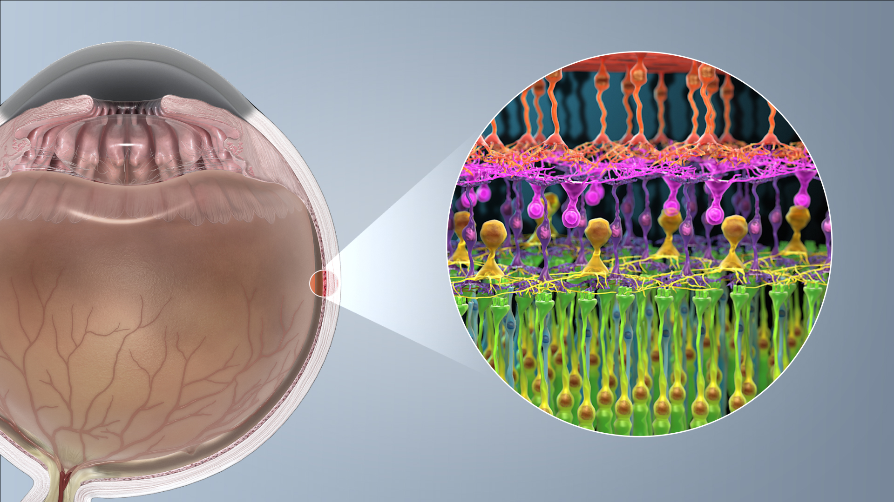

### BTM Data Visualization
In order to follow along with this session you will need R (ideally R studio) with a few packages installed. 

#### Options to use R Studio
- First download [R](https://cran.r-project.org/) and then [R Studio](https://www.rstudio.com/products/rstudio/download/#download) to your local machine 
- Alternatively you can run an Rstudio session in the [cloud](https://rstudio.cloud/) 

#### Required Packages
Whichever version you use you will need to install some key packages. So run these lines first. 
```
install.packages(ggplot2)
install.packages(reshape2)
```

#### Data We Will Be Using
We will be looking at gene expression data from mouse photoreceptors. There are samples from different developmental stages (E16,P2,P6,P10 and 4 weeks) and two mouse lines, a wildtype (wt) and knockouts for rod cell specific transcription factor (NrlKO). The gene expression and sample information data were collected from the Gene Expression Omnibus (GEO), under study ID [GSE4051](https://www.ncbi.nlm.nih.gov/geo/query/acc.cgi?acc=GSE4051).

For more information on the actual paper see the associated [publication](http://www.pnas.org/cgi/pmidlookup?view=long&pmid=16505381).

<p align="left">
  
    <figcaption> <sup>www.scientificanimations.com [<a href="https://creativecommons.org/licenses/by-sa/4.0">CC BY-SA 4.0</a>], <a href="https://commons.wikimedia.org/wiki/File:Photoreceptor_cell.jpg">via Wikimedia Commons</a></sup></figcaption>
</p>

#### How do I get this data?
