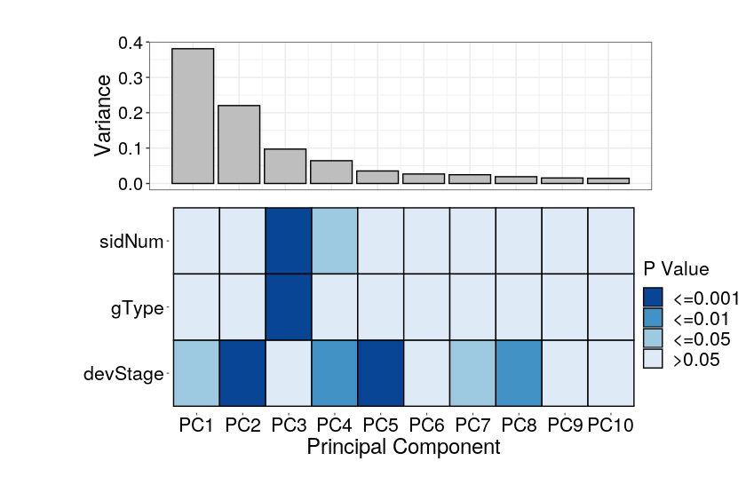
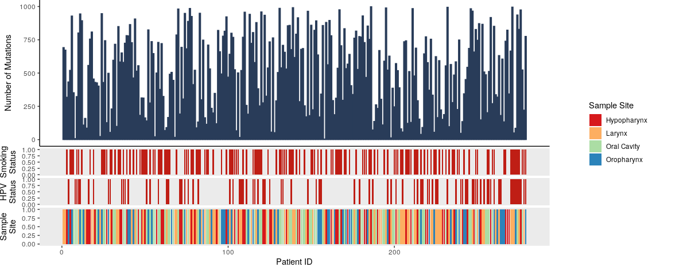
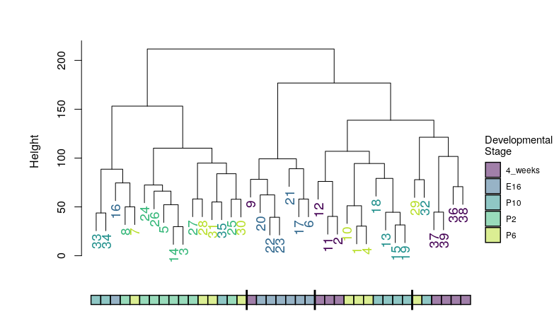

# BTM Data Visualization
In order to follow along with this session you will need R (ideally R studio) with a few packages installed. 

#### Options to use R Studio
- First download [R](https://cran.r-project.org/) and then [R Studio](https://www.rstudio.com/products/rstudio/download/#download) to your local machine 
- Alternatively you can run an Rstudio session in the [cloud](https://rstudio.cloud/) 

#### Required Packages
Whichever version you use you will need to install some key packages. So run these lines first. 
```
install.packages("ggplot2")
install.packages("reshape2")
```

or with conda
```
conda install -c conda-forge r-ggplot2 r-reshape2 
```

#### Data We Will Be Using
We will be looking at gene expression data from mouse photoreceptors. There are samples from different developmental stages (E16,P2,P6,P10 and 4 weeks) and two mouse lines, a wildtype (wt) and knockouts for rod cell specific transcription factor (NrlKO). The gene expression and sample information data were collected from the Gene Expression Omnibus (GEO), under study ID [GSE4051](https://www.ncbi.nlm.nih.gov/geo/query/acc.cgi?acc=GSE4051).

For more information on the actual paper see the associated [publication](http://www.pnas.org/cgi/pmidlookup?view=long&pmid=16505381).

<p align="left">
  
    <figcaption> <sup>www.scientificanimations.com [<a href="https://creativecommons.org/licenses/by-sa/4.0">CC BY-SA 4.0</a>], <a href="https://commons.wikimedia.org/wiki/File:Photoreceptor_cell.jpg">via Wikimedia Commons</a></sup></figcaption>
</p>

#### How do I get this data? Four possible ways:

- Set up with git up? clone the BTM repo
```
git clone https://github.com/redgar598/EMBL_BTM_2019.git
```
- clone right from RStudio (detailed instructions [here](https://happygitwithr.com/new-github-first.html))  
    - Start a new project (file>new project or new project drop down then "New Project from Git Repo"))
    - Then select Version Control, then git
    - Paste the repository url https://github.com/redgar598/EMBL_BTM_2019.git
    - In an ideal world you will end up with all the EMBL_BTM scripts/data cloned and ready
    - Check out the data_visualization folder, it is the best one!

- Want everything but don't have git? Download [this](https://github.com/redgar598/EMBL_BTM_2019/archive/master.zip)

- Collect the R script ([gene_expression_example_plots.R](https://github.com/redgar598/EMBL_BTM_2019/blob/master/data_visualization/gene_expression_example_plots.R)) and [data](https://github.com/redgar598/EMBL_BTM_2019/tree/master/data_visualization/data) individually


___


<br/><br/>

# BTM Data Visualization Part 2
This session will be a workshop with several examples of complex plots presented. The goal will be to recreate these plots in R and ggplot. The aim is that, through recreating these plots, we can explore the many elements available to make complex plots in R without adjustment in a illustrator software. 

Though you can develop your plots using any packages you like. I recommend the installation of these
```
install.packages("ggplot2")
install.packages("reshape2")
install.packages("RColorBrewer")
install.packages("scales")
install.packages("gridExtra")
install.packages("rafalib")
```

or through conda

```
conda install -c conda-forge ggplot r-reshape2 r-rcolorbrewer r-scales r-gridextra r-rafalib
```

We will start with a [volcano plot](https://github.com/redgar598/EMBL_BTM_2019/blob/master/data_visualization/extended_plotting.R) I have made. 


<p align="left">
  <a href="https://github.com/redgar598/EMBL_BTM_2019/tree/master/data_visualization">

  </a>
</p>

## Examples to Try and Replicate
<br/>

### Example 1
This example is take from the [simply statistics blog](https://simplystatistics.org/2019/08/28/you-can-replicate-almost-any-plot-with-ggplot2/). 

<p align="left">
  
</p>

The "dslabs" package is the data set to plot and "dplyr" is recommended for data tidying but not necessary. 


```
install.packages("dslabs")
install.packages("dplyr") #or with conda: conda install -c conda-forge r-dplyr 

library(dslabs)
data(us_contagious_diseases)
head(us_contagious_diseases)
```
<br/>

### Example 2

Principal Components Analysis (PCA) was done on gene expression data. The output is saved in 'gene_expression_PCA_data.RData' Loadings are the PCA loadings for each sample which can then be associated with sample information. Importance is the variance explained by each PC. I have used and ANOVA to generate the association P values of each PC and the sample information available. 

<p align="left">
  
</p>

```
load("data/gene_expression_PCA_data.RData")

library(gridExtra)
library(reshape2)
library(ggplot2)
```

### Example 3
The following example is for patient mutation data in relation of clinical factors. The provided code generates data to make the plot. 

<p align="left">
  
</p>

```
library(gridExtra)
library(grid)
library(ggplot2)

set.seed(1)
pt_id = c(1:279) # DEFINE PATIENT IDs
smoke = rbinom(279,1,0.5) # DEFINE SMOKING STATUS
hpv = rbinom(279,1,0.3) # DEFINE HPV STATUS
data = data.frame(pt_id, smoke, hpv) # PRODUCE DATA FRAME

data$site = sample(1:4, 279, replace = T)
data$site[data$site == 1] = "Hypopharynx"
data$site[data$site == 2] = "Larynx"
data$site[data$site == 3] = "Oral Cavity"
data$site[data$site == 4] = "Oropharynx"
data$site_known = 1 

data$freq = sample(1:1000, 279, replace = F)

```

### Example 4
The following example is for visualizing clustering data with color. The provided code loads data and does the clustering to generate the dendogram. I recommend *myplclust* from the rafalib package for coloring the clustering labels by developmental stage.

<p align="left">
  
</p>

```
library(rafalib)
library(ggplot2)
library(grid)
library(gridExtra)

#load data
geneExp <- read.table("data_visualization/data/GSE4051_data.tsv", stringsAsFactors = FALSE, sep = "\t", header=T)
sampleInfo <- read.table("data_visualization/data/GSE4051_design.tsv", stringsAsFactors = FALSE, sep = "\t", header=T)

## cluster samples based on gene expression
d <- dist(t(geneExp))
hc <- hclust(d, method = "complete") 
```


<br/>
<br/>

### Additional Resources
[Effective Visual Communication for the Quantitative Scientist](https://ascpt.onlinelibrary.wiley.com/doi/full/10.1002/psp4.12455)
<br/>
[ggplot cheat sheet](https://www.rstudio.com/wp-content/uploads/2015/03/ggplot2-cheatsheet.pdf)
<br/>
[Points of View columns on data visualization](http://blogs.nature.com/methagora/2013/07/data-visualization-points-of-view.html)
