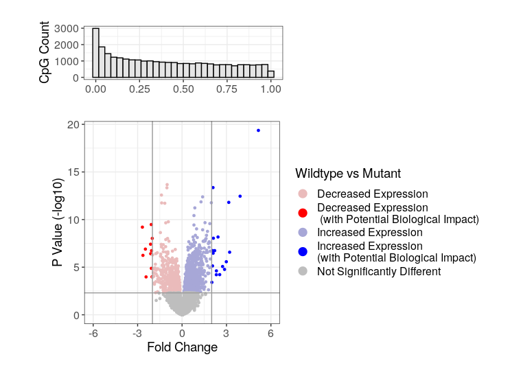

# BTM Data Visualization
In order to follow along with this session you will need R (ideally R studio) with a few packages installed. 

#### Options to use R Studio
- First download [R](https://cran.r-project.org/) and then [R Studio](https://www.rstudio.com/products/rstudio/download/#download) to your local machine 
- Alternatively you can run an Rstudio session in the [cloud](https://rstudio.cloud/) 

#### Required Packages
Whichever version you use you will need to install some key packages. So run these lines first. 
```
install.packages(ggplot2)
install.packages(reshape2)
```

or with conda
```
conda install -c conda-forge r-ggplot2 r-reshape2 
```

#### Data We Will Be Using
We will be looking at gene expression data from mouse photoreceptors. There are samples from different developmental stages (E16,P2,P6,P10 and 4 weeks) and two mouse lines, a wildtype (wt) and knockouts for rod cell specific transcription factor (NrlKO). The gene expression and sample information data were collected from the Gene Expression Omnibus (GEO), under study ID [GSE4051](https://www.ncbi.nlm.nih.gov/geo/query/acc.cgi?acc=GSE4051).

For more information on the actual paper see the associated [publication](http://www.pnas.org/cgi/pmidlookup?view=long&pmid=16505381).

<p align="left">
  
    <figcaption> <sup>www.scientificanimations.com [<a href="https://creativecommons.org/licenses/by-sa/4.0">CC BY-SA 4.0</a>], <a href="https://commons.wikimedia.org/wiki/File:Photoreceptor_cell.jpg">via Wikimedia Commons</a></sup></figcaption>
</p>

#### How do I get this data?

- Set up with git up? clone the BTM repo
```
git clone https://github.com/redgar598/EMBL_BTM_2019.git
```
- clone right from RStudio (detailed instructions [here](https://happygitwithr.com/new-github-first.html))  
    - Start a new project (file>new project or new project drop down then "New Project from Git Repo"))
    - Then select Version Control, then git
    - Paste the repository url https://github.com/redgar598/EMBL_BTM_2019.git
    - In an ideal world you will end up with all the EMBL_BTM scripts/data cloned and ready
    - Check out the data_visualization folder, it is the best one!

- Want everything but don't have git? Download [this](https://github.com/redgar598/EMBL_BTM_2019/archive/master.zip)

- Collect the R script ([gene_expression_example_plots.R](https://github.com/redgar598/EMBL_BTM_2019/blob/master/data_visualization/gene_expression_example_plots.R)) and [data](https://github.com/redgar598/EMBL_BTM_2019/tree/master/data_visualization/data) individually


___


<br/><br/>

# BTM Data Visualization Part 2
This session will be a workshop with several examples of complex plots presented. The goal will be to recreate these plots in R and ggplot. The aim is that thorough recreating these plots we can explore the many elements available to make complex plots in R without adjustment in a illustrator software. 

Though you can develop your plots using any packages you like. I recommend the installation fo these
```
install.packages(ggplot2)
install.packages(reshape2)
install.packages(RColorBrewer)
install.packages(scales)
install.packages(gridExtra)
```

or through conda
```
conda install -c conda-forge ggplot r-reshape2 r-rcolorbrewer r-scales r-gridextra

```

We will start with a [volcano plot](https://github.com/redgar598/EMBL_BTM_2019/blob/master/data_visualization/extended_plotting.R) I have made. 


<p align="left">
  <a href="https://github.com/redgar598/EMBL_BTM_2019/tree/master/data_visualization">

  </a>
</p>

