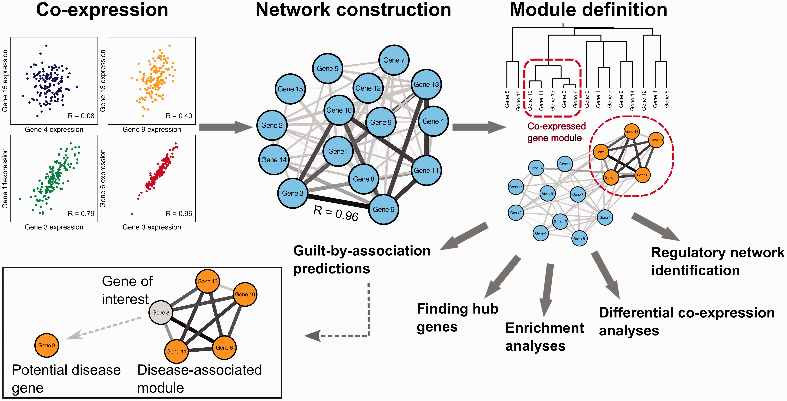
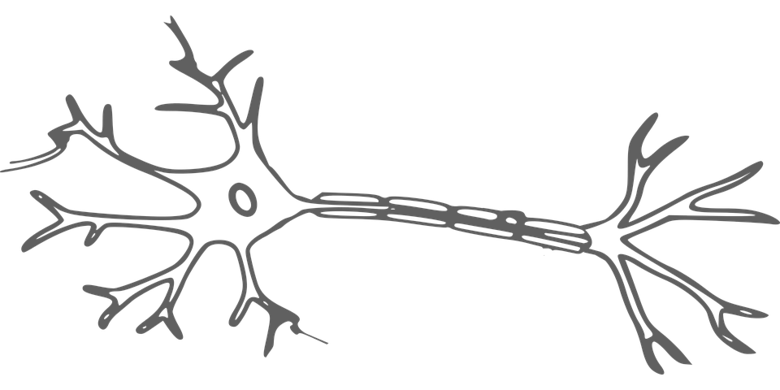

# BTM Network Visualization
In order to follow along with this session you will need Cytoscape, but you can also just watch the walkthrough if you can't be bothered to install something. 

  
    <figcaption> Martin Grandjean [<a href="https://creativecommons.org/licenses/by-sa/4.0">CC BY-SA 4.0</a>], <a href="https://commons.wikimedia.org/wiki/File:SocialNetworkAnalysis.png">via Wikimedia Commons</a></figcaption>

#### Networks We Will Be Using
We will walk through an example together then you are free to work through one example network visulization on either:
- Cell-cell connectivity
- Gene co-expression
- Authorship network

#### How do I get this data?

___

  

## Gene Coexpression Data 
The gene expression and sample information data were collected from the Gene Expression Omnibus (GEO), under study ID [GSE4051](https://www.ncbi.nlm.nih.gov/geo/query/acc.cgi?acc=GSE4051). The coexpression weights are from a Weighted Gene Coexpression Netwrok Analysis ( [WGCNA](https://horvath.genetics.ucla.edu/html/CoexpressionNetwork/Rpackages/WGCNA/) ). Only the 95 most variable genes were used for calculating coexpression. Genes were sorted into two coexpression clusters (turquoise and grey), which represent genes expressed with a similar pattern as cross samples. 

Suggested network building:
> - File -> Import -> Network from File -> gene_coexpression_edges.txt 
> - Label "fromNode" as the source for node connections and "toNode" as the target.
> - File -> Import -> Table from File -> gene_coexpression_nodes.txt 
> - "nodeName" should automatically be the key to merge the edge and node tables. 
> - Under the Style tab and Node settings try Fill Color as "nodeAttr". Try and match cluster name to actual color.
> - Then layout so the grey and turquiose modules are seperate
> - Find the clearest way to weight the edges by the coexpression weight (i.e transparency, color, width)

  
  <figcaption> van Dam S, Võsa U, van der Graaf A, Franke L, de Magalhães JP. (2017) Gene co-expression analysis for functional classification and gene-disease predictions. Brief Bioinform</figcaption>
  

## Brain Cell Connectivity
Complete information on the data set is available on the [Allen Institute Site](http://alleninstitute.github.io/AllenSDK/connectivity.html). In short, the data collected consists of axonal projections targeting adult mouse brain structures. Selected experiments are from wild-type injections into the hypothalamus (HY) and into primary visual area (VISp).

[Information on the fields available in the network](http://alleninstitute.github.io/AllenSDK/unionizes.html)

If you would like to explore the connections of projections in mouse brain structures download both csv files [here](https://github.com/redgar598/EMBL_BTM_2019/tree/master/network_visualization/data)

Suggested network building:
> - File -> Import -> Network from File -> edges_allen.csv 
> - Label "injection" as the source for node connections and "structure_id" as the target. For values in injection column 385=VISp_edges and 1097=HY
> - File -> Import -> Table from File -> nodes_allen.csv 
> - "id" should automatically be the key to merge the edge and node tables. 
> - Under the Style tab and Node settings try Label as "acronym" since these are a bit more meaningful. 

According to the Allen Institute page "<em>Most commonly used for analysis are measures of the <strong>density of projection signal</strong> </em>"

  

