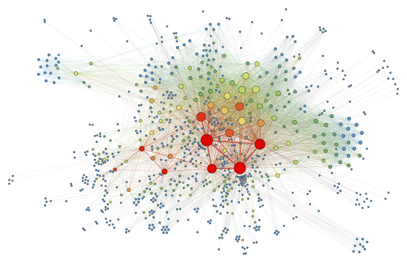

# BTM Network Visualization
In order to follow along with this session you will need Cytoscape, but you can also just watch the walkthrough if you can't be bothered to install something. 

#### Data We Will Be Using
We will walk through an example together then you are free to work through one guided on either:
- Cell connectivity
- Gene co-expression
- Authorship network

#### How do I get this data?

  
    <figcaption> Martin Grandjean [<a href="https://creativecommons.org/licenses/by-sa/4.0">CC BY-SA 4.0</a>], <a href="https://commons.wikimedia.org/wiki/File:SocialNetworkAnalysis.png">via Wikimedia Commons</a></figcaption>

